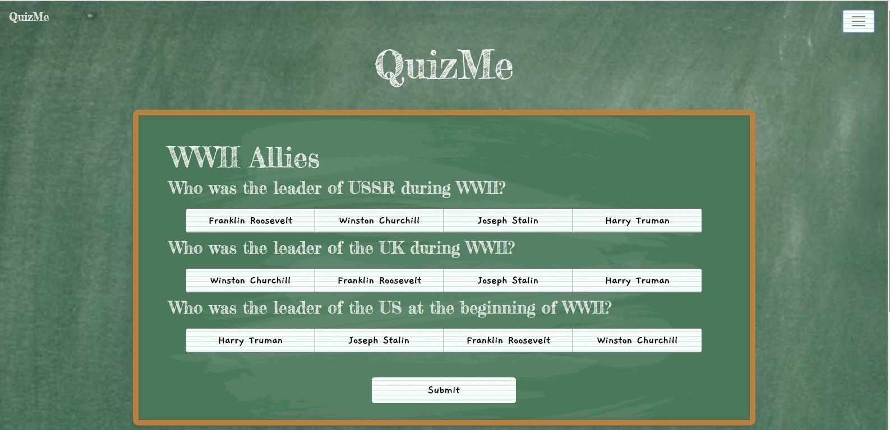

# QuizMe

## Overview

An application that allows users to take quizzes to test their knowledge of a given subject. Users can also post quizzes of their own for themselves, or others, to take.

## Instructions

QuizMe is an application that allows users to take quizzes about any subject they choose. The quizzes posted by users are available for others to take as well.

Click the piece of paper in the upper right corner to choose whether you'd like to take a quiz or submit a quiz.

If the user chooses to take a quiz they are taken to a page displaying all available quizzes. Click of the title of the quiz you'd like to take.

When a quiz is chosen the user is taken to a page displaying the questions and answer options.

The user chooses their answers and after clicking submit is told how many they got correct.

If the user chooses to submit a quiz they are taken to a form to fill out with questions and answer options.

After completing the form the user clicks the submit button. The new quiz is then displayed with the other available quizzes.

## Technologies Used

* HTML5
* MongoDB
* Bootstrap
* CSS
* React JS

## Website

https://agile-lowlands-99357.herokuapp.com/
